<div align="center">




<a href="https://github.com/willythecreator">
  
</a>

<br>

[]()
[]()
[]()

</div>

---

### `> Orbit`

```yaml
location: Madrid, Spain
stack: [C, C++, Python, Java, Rust, JavaScript, TypeScript]
focus:
  - Gameboy Advance emulator (Advance-Pocket)
  - Astrophysics & cosmology simulators
  - Low-level optimization
learning: [CS50, LLMs, AI security, systems programming]
philosophy: "Optimize, right, interesting."
```

### `> Tech Stack`

<p align="center">
  
  
  
  
  
  
  
</p>


### `> Projects`

<details open>
<summary><b>Emulation</b></summary>
<br>

| Project | Description |
|---------|-------------|
| [Advance-Pocket](https://github.com/willythecreator/Advance-Pocket) | GBA emulator in C++ |

</details>

<details>
<summary><b>Physics & Cosmology</b></summary>
<br>

| Project | Description |
|---------|-------------|
| Schwarzschild Black Hole Geodesic Tracer | Real-time GPU geodesic ray tracer with accretion disk, Doppler beaming, FBM turbulence (C++/OpenGL/GLSL) |
| Gravitational Lensing Ray Tracer | Simulate lensing from massive objects |
| Three-Body Problem Visualizer | Chaotic N-body orbital mechanics |
| Two-Body Gravitational Orbit Simulator | Classical orbital dynamics |
| Lunar Lander Physics Sim | Thrust and gravity simulation |
| Neutron Star EOS Solver | Equation of state for degenerate matter |
| Nuclear Fusion Rate Calculator | Fusion rates inside stellar cores |
| Supernova Light Curve Modeler | Stellar explosion luminosity over time |
| Hubble Expansion Rate Visualizer | Cosmic expansion dynamics |
| BAO Visualizer | Baryon acoustic oscillation mapping |
| Large-Scale Structure Filament Sim | Cosmic web formation |
| Hertzsprung-Russell Diagram Plotter | Star classification from catalog data |

</details>

<details>
<summary><b>Graphics & Fractals</b></summary>
<br>

| Project | Description |
|---------|-------------|
| Mandelbrot Set Renderer | Escape-time fractal in C |
| Julia Set Explorer | Interactive complex-dynamics viewer |
| Perlin Noise Terrain Generator | Heightmap generation |
| Barnsley Fern Renderer | IFS fractal renderer |
| Lissajous Curve Animator | Parametric curve visualization |
| Spinning Donut | ASCII 3D donut in C |

</details>

<details>
<summary><b>Tools & Algorithms</b></summary>
<br>

| Project | Description |
|---------|-------------|
| Password Manager | AES-encrypted credential storage |
| K-Means Clustering | Unsupervised learning from scratch |
| Sorting Algorithm Visualizer | Live algorithm comparison |
| Matrix Calculator | Linear algebra operations |
| Geometric Theorem Prover | Automated geometric reasoning |
| Telescope PSF Simulator | Point-spread function modeling |

</details>

<details>
<summary><b>Games</b></summary>
<br>

| Project | Description |
|---------|-------------|
| [Tetris](https://github.com/willythecreator/Tetris) | Classic tetromino stacking (SDL2, C++) |
| [Chess Engine (Python)](https://github.com/willythecreator/Chess-Game-Engine-in-Python) | UCI-compliant chess AI |
| Chess Engine (C) | Lower-level chess AI |
| Space Invaders | Classic arcade shooter |
| Battleship (2-player) | Naval combat game |

</details>


### `> Stats`

<p align="center">
  
  
</p>

<p align="center">
  
</p>

<p align="center">
  
</p>

### `> Contribution Graph`

<p align="center">
  
</p>

<p align="center">
  <i>"C makes it easy to shoot yourself in the foot; C++ makes it harder, but when you do it blows your whole leg off."</i><br>
  <sub>-- Bjarne Stroustrup</sub>
</p>


